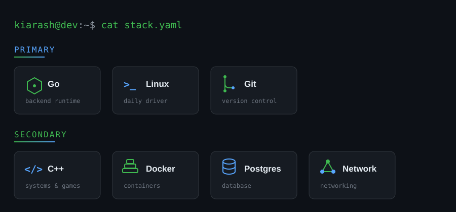

  

  

  

---

## Breaking systems down to understand how they really work

I'm Kiarash Habibi, a Computer Engineering student focused on backend development in Go and offensive security.
My sweet spot is the space between building and breaking — writing clean backend systems, then stepping back to look at them the way an attacker would.

---

## What I'm focused on

- 🔧 Backend Development with Go
- 🏗️ System Design & Clean Architecture
- 🐧 Linux

---

## Tech Stack

---

## Security

- 🛡️ OWASP Top 10
- 🎯 Bug Bounty & Web Security
- 📦 Hack The Box Academy
- 🔓 Linux Privilege Escalation
- 🌐 Network Security Fundamentals

---

## Featured Projects

### 📝 [Marginalia — Weblog App](https://github.com/kiarash86/weblog_goraz)
A shared weblog built with **Go**, **Echo**, and **PostgreSQL**. Users can post public or private entries, share private entries with specific people, and leave comments. JWT-based auth, image uploads, and a vanilla JS frontend — no framework, no build step.

### 🎲 [Unmatched — Card Game Engine](https://github.com/kiarash86/unmatched)
A **C++17**, data-driven digital implementation of the *Unmatched* board game, built with raylib. New heroes, cards, and maps are added entirely through JSON — no C++ changes required. Uses Factory and Observer patterns, plus a custom exception hierarchy so failures are caught and reported with context instead of crashing.

---

## GitHub Stats

---

### Connect With Me

<a href="https://www.linkedin.com/in/kiarashhabibi">LinkedIn</a>
•
<a href="mailto:kiarash.h.dev@gmail.com">Email</a>
•
<a href="https://github.com/kiarash86">GitHub</a>

---

