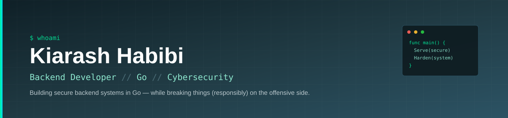

  

  

  

---

## About Me

<table>
<tr>
<td width="200" valign="top">

</td>
<td valign="top">

I'm a Computer Engineering student passionate about backend development, Linux and cybersecurity.
My primary focus is building secure backend systems with Go while continuously improving my web security and bug bounty skills.
I enjoy understanding how systems work, finding vulnerabilities and writing clean, maintainable software.

**Current focus:** Backend Development with Go · Web Security · Bug Bounty · Linux · System Design · Secure Software Engineering

</td>
</tr>
</table>

---

## Tech Stack

**Primary**

**Secondary**

---

## Security

- OWASP Top 10
- Web Security & Bug Bounty
- Hack The Box Academy
- Linux Privilege Escalation
- Network Security Fundamentals

---

## Featured Projects

**In progress / not public yet**

- 🌐 **HTTP Server (Go)** — high-performance HTTP server built using the Go standard library
- 🔗 **REST API** — RESTful backend application with authentication and clean architecture
- 📝 **Bug Bounty Write-ups** — coming soon

---

## Currently Learning

- Go Concurrency
- Backend Architecture
- Bug Bounty
- Linux Internals
- Web Application Security

---

---

## GitHub Stats

---

### Connect With Me

<a href="https://www.linkedin.com/in/kiarashhabibi">LinkedIn</a>
•
<a href="mailto:YOUR_EMAIL@gmail.com">Email</a>
•
<a href="https://github.com/kiarash86">GitHub</a>

---

